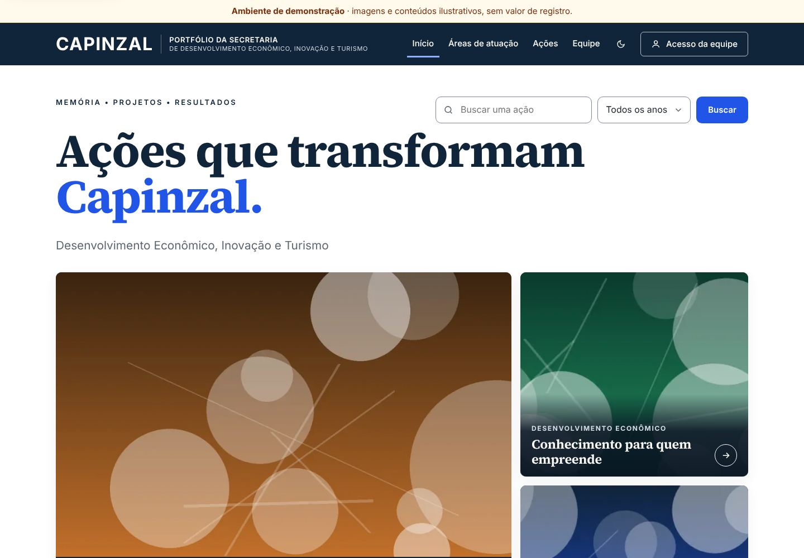

# Portfólios institucionais — mostraqui.net

Portfólio institucional da **Secretaria de Desenvolvimento Econômico, Inovação e Turismo de
Capinzal**, publicado direto em **mostraqui.net**. O site público é consultável sem cadastro e tem
estilo de revista institucional. Um painel com autenticação permite à equipe manter o conteúdo sem
editar código.



> As imagens acima são do **ambiente de demonstração**: ilustrações abstratas geradas pelo sistema e
> textos fictícios, sem registro de eventos, pessoas ou lugares reais.

## Principais recursos

- **Portfólio único no domínio:** Capinzal em `mostraqui.net` (padrão). Se outros órgãos forem
  atendidos no futuro, a mesma instalação hospeda vários portfólios isolados, por caminho
  (`mostraqui.net/capinzal`) ou subdomínio, com a troca de uma linha no `.env` e sem quebrar os
  endereços já divulgados. Ver [docs/MULTIPORTFOLIO-E-SUBDOMINIOS.md](docs/MULTIPORTFOLIO-E-SUBDOMINIOS.md).
- **Implantação automática por FTP:** cada aprovação no branch `main` é testada e enviada à
  HostGator por FTPS, sem SSH, e o banco é atualizado sozinho. Ver [docs/IMPLANTACAO-AUTOMATICA.md](docs/IMPLANTACAO-AUTOMATICA.md).
- **Público:** destaque principal e secundários, filtros por área, busca por nome, área, período,
  tipo e situação, página própria de cada ação com galeria acessível, vídeos e reportagens, equipe,
  parceiros, resultados documentados, tema escuro e compartilhamento com título, resumo e capa.
- **Painel:** perfis Master, Editor e Colaborador com permissões por área verificadas no servidor;
  ações com rascunho, revisão, devolução, publicação e versões; páginas montadas por blocos com
  prévia e publicação; campos adicionais; equipe; parceiros; biblioteca de mídias; usuários por
  convite; registro de atividades.
- **Integridade:** indicadores só aparecem com fonte, unidades diferentes não se somam,
  participações não são apresentadas como pessoas únicas, e uma ação ligada a duas áreas conta uma
  vez.
- **Segurança e privacidade:** páginas públicas sem cookies, arquivos privados até a publicação,
  remoção de metadados GPS das fotos, proteção contra SSRF, conteúdo de terceiros só após o clique.

## Tecnologia

Laravel 13 (PHP **8.3+**), MySQL/MariaDB, HTML gerado no servidor, CSS e JavaScript sem etapa de
compilação e fontes locais (Source Serif 4 e Inter, SIL OFL). Feito para hospedagem compartilhada
com cPanel (HostGator).

## Rodar localmente

```bash
composer install
cp .env.example .env            # ajuste: APP_ENV=local, APP_DEBUG=true, APP_URL=http://localhost:8000,
                                # DB_CONNECTION=sqlite (ou MySQL), MAIL_MAILER=log, SESSION_SECURE_COOKIE=false
php artisan key:generate
touch database/database.sqlite  # se usar SQLite
php artisan migrate
php artisan mostraqui:instalar  # portfólio de Capinzal + conta de administração (senha digitada de forma oculta)
php artisan mostraqui:demo      # opcional: conteúdo de demonstração (recusado em produção)
php artisan serve               # http://localhost:8000 (portfólio) e http://localhost:8000/painel
```

## Comandos

| Comando | Para quê |
| --- | --- |
| `php artisan mostraqui:instalar [--convite]` | Primeira instalação: portfólio e conta de administração |
| `php artisan mostraqui:novo-portfolio "Nome" --endereco=x [--master-email=...]` | Novo portfólio (aparece no site nos modos `path` e `subdomain`), com convite do Master |
| `php artisan mostraqui:criar-master ENDERECO` | Outro Administrador Master de um portfólio (convite) |
| `php artisan mostraqui:admin-plataforma [--convite]` | Outra conta de administração da plataforma |
| `php artisan mostraqui:backup [--manter=14]` | Cópia completa (banco + arquivos) em `storage/app/backups` |
| `php artisan mostraqui:restaurar ARQUIVO.zip` | Restaura uma cópia (substitui os dados atuais) |
| `php artisan mostraqui:demo [--portfolio=x]` | Conteúdo de demonstração, só fora de produção |
| `./scripts/empacotar.sh` | Gera os pacotes para enviar ao cPanel à mão |
| `bash deploy/implantar-ftp.sh` | Implantação por FTPS (usada pelo GitHub Actions; variáveis em `docs/IMPLANTACAO-AUTOMATICA.md`) |

## Testes

```bash
php artisan test                              # 62 testes (aceite, segurança, integridade, implantação, modos de endereço e unitários)
# Contra MySQL/MariaDB: DB_CONNECTION=mariadb DB_DATABASE=... DB_USERNAME=... DB_PASSWORD=... php artisan test
BASE_URL=http://127.0.0.1:8000 node tests/browser/verificar.cjs   # celular, teclado e axe-core (exige playwright e axe-core)
```

## Documentação

| Documento | Conteúdo |
| --- | --- |
| [docs/PLANO.md](docs/PLANO.md) | Decisões, modelo de dados, permissões, fluxo editorial, fases e pendências |
| [docs/IMPLANTACAO-AUTOMATICA.md](docs/IMPLANTACAO-AUTOMATICA.md) | **Implantação automática GitHub → HostGator** por FTP com criptografia (sem SSH), passo a passo |
| [docs/IMPLANTACAO-HOSTGATOR.md](docs/IMPLANTACAO-HOSTGATOR.md) | Passo a passo de instalação manual no cPanel, sem terminal |
| [docs/MULTIPORTFOLIO-E-SUBDOMINIOS.md](docs/MULTIPORTFOLIO-E-SUBDOMINIOS.md) | Portfólio único (atual), por caminho ou por subdomínio: como mudar no futuro |
| [docs/MANUAL-DA-EQUIPE.md](docs/MANUAL-DA-EQUIPE.md) | Como usar o painel |
| [docs/BACKUP-E-RESTAURACAO.md](docs/BACKUP-E-RESTAURACAO.md) | Cópias de segurança e restauração |
| [docs/SEGURANCA-E-PRIVACIDADE.md](docs/SEGURANCA-E-PRIVACIDADE.md) | Proteções, LGPD e credenciais necessárias |
| [docs/ACESSIBILIDADE.md](docs/ACESSIBILIDADE.md) | Meta WCAG 2.2 AA, contrastes calculados e resultados dos testes |
| [docs/ESTADO-DA-ENTREGA.md](docs/ESTADO-DA-ENTREGA.md) | O que funciona, o que foi testado, o que depende de configuração e o que ainda não existe |

## Licenças de terceiros

Laravel (MIT), Intervention Image (MIT), league/commonmark (BSD-3-Clause), fontes Source Serif 4 e
Inter (SIL Open Font License 1.1; arquivos de licença em `public/assets/fonts`).
